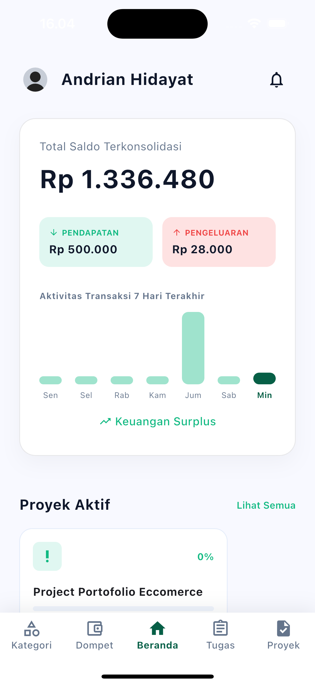
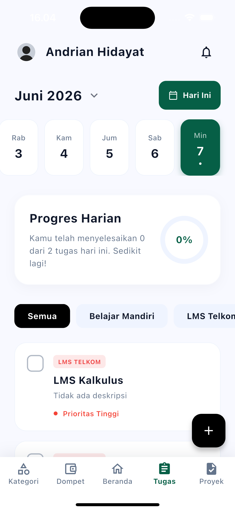
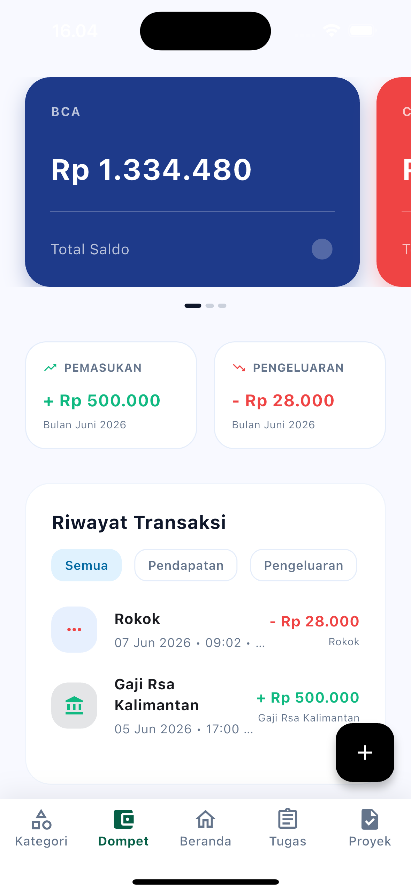
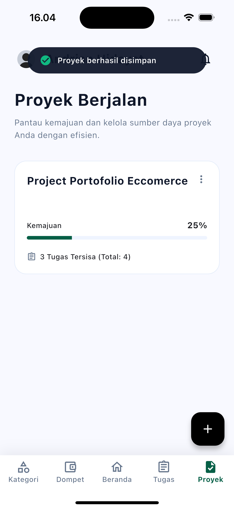
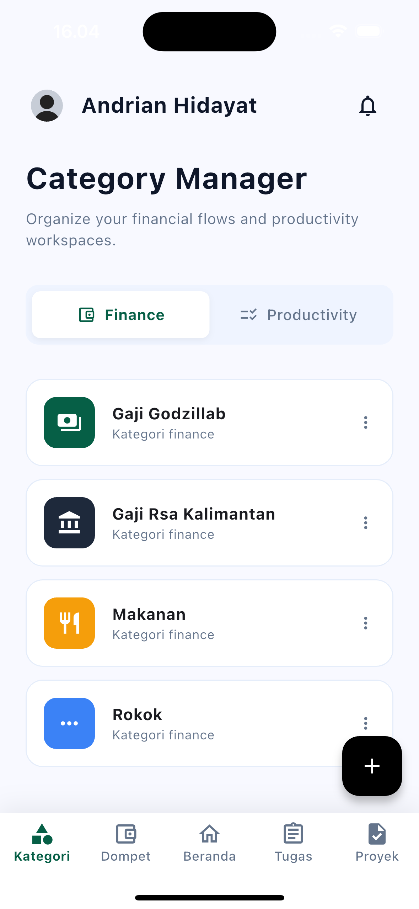

# LifeSync 

LifeSync adalah aplikasi *all-in-one* yang menggabungkan manajemen produktivitas (tugas dan proyek) dengan manajemen keuangan (dompet dan transaksi). Aplikasi ini dirancang untuk membantu Anda menyeimbangkan kehidupan sehari-hari dengan memantau apa yang perlu dikerjakan dan ke mana uang Anda mengalir, semuanya dalam satu tempat yang terpusat.

## 🌟 Fitur Utama

- **Manajemen Tugas (Task Management)**: Buat, jadwalkan, dan lacak tugas harian Anda. Tugas yang belum selesai akan terus dibawa ke hari berikutnya (backlog) hingga diselesaikan.
- **Manajemen Keuangan (Wallet & Transactions)**: Lacak pemasukan dan pengeluaran dari berbagai sumber dana (dompet). Pantau ringkasan keuangan bulanan Anda secara otomatis.
- **Proyek & Kategori**: Kelompokkan tugas dan keuangan Anda berdasarkan kategori khusus yang dapat Anda buat dan sesuaikan sendiri.
- **Notifikasi Pintar**: Dapatkan pengingat otomatis setiap hari, mulai dari laporan produktivitas kemarin (Pagi), pengingat tugas (Siang), hingga rangkuman harian di malam hari.
- **Autentikasi & Profil Terintegrasi**: Sistem login aman, manajemen profil pengguna, dan preferensi notifikasi menggunakan backend Supabase.

## 🛠️ Teknologi yang Digunakan

- **Framework**: [Flutter](https://flutter.dev/) (Dukungan penuh untuk Mobile dan Desktop macOS)
- **State Management & Routing**: [GetX](https://pub.dev/packages/get)
- **Backend & Autentikasi**: [Supabase](https://supabase.com/)
- **Penyimpanan Lokal**: Shared Preferences / CacheService

---

## 🚀 Cara Menjalankan Proyek (Getting Started)

Ikuti langkah-langkah di bawah ini untuk menjalankan LifeSync di mesin lokal Anda.

### 1. Persyaratan Sistem (Prerequisites)
Pastikan Anda sudah menginstal alat-alat berikut:
- [Flutter SDK](https://docs.flutter.dev/get-started/install) (versi terbaru sangat disarankan)
- Git
- Editor pilihan Anda (VS Code, Android Studio, atau IntelliJ)

### 2. Kloning Repositori
Clone repositori ini ke dalam komputer Anda:
```bash
git clone <url-repositori-anda>
cd lifesync_app
```

### 3. Mengunduh Dependensi
Jalankan perintah berikut untuk mengunduh semua pustaka (packages) yang dibutuhkan:
```bash
flutter pub get
```

### 4. Konfigurasi Backend (Supabase)
Karena alasan keamanan, kredensial backend Supabase tidak dimasukkan ke dalam version control (Git). Anda harus membuat file konstanta secara manual:

1. Buat file baru di path berikut:  
   `lib/core/constants/supabase_constants.dart`
2. Isi file tersebut dengan kredensial Supabase Anda:
   ```dart
   class SupabaseConstants {
     static const String url = 'URL_SUPABASE_ANDA';
     static const String anonKey = 'ANON_KEY_SUPABASE_ANDA';
   }
   ```
*(Ganti nilai `url` dan `anonKey` dengan data dari dashboard project Supabase Anda).*

### 5. Menjalankan Aplikasi
Anda dapat langsung menjalankan aplikasi di emulator (Android/iOS) atau sebagai aplikasi desktop (macOS/Windows):
```bash
flutter run
```
Atau gunakan tombol **Run/Debug** di dalam IDE Anda.

---

## 📸 Cuplikan Aplikasi (Screenshots)

*(Tambahkan gambar screenshot aplikasi Anda di dalam folder `docs/images/` atau folder lain, lalu masukkan tautan gambarnya di bawah ini)*

<p align="center">
  
  &nbsp;&nbsp;&nbsp;
  
  &nbsp;&nbsp;&nbsp;
  
  <br><br>
  
  &nbsp;&nbsp;&nbsp;
  
</p>

---

## 📂 Struktur Folder Utama

- `lib/app/modules/`: Berisi semua halaman utama (Home, Login, Task, Wallet, Profile, dll). Setiap modul menerapkan pola MVC/GetX (View, Controller, Binding).
- `lib/app/data/`: Menyimpan semua *Provider* (berinteraksi dengan Supabase) dan *Model* (representasi data JSON).
- `lib/core/`: Menyimpan komponen inti aplikasi, seperti layanan (Service), middleware, tema warna (AppColors), widget UI reusable, dan konstanta (Constants).

---

Dibuat dengan ❤️ untuk produktivitas yang lebih baik.
